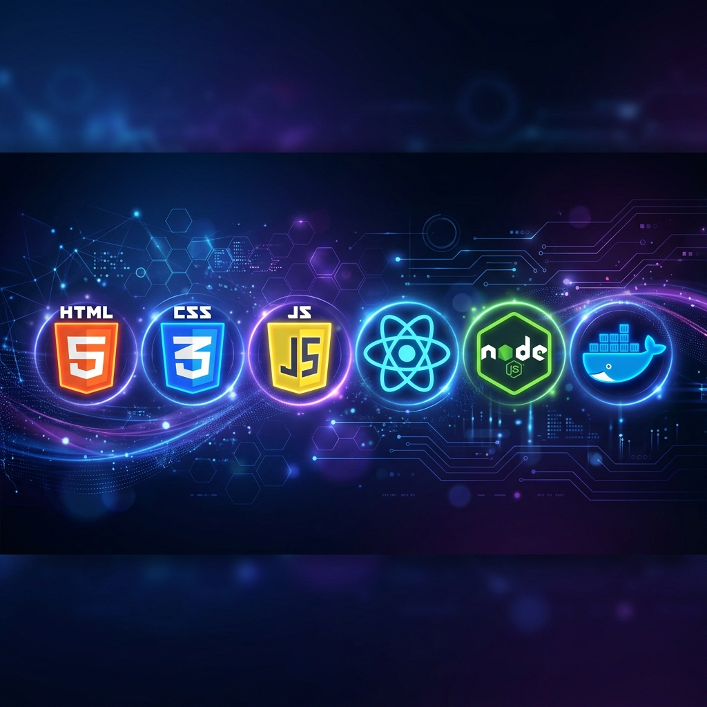

<div align="center">
  
  
  # 🚀 Web FullStack Study
  
  **A comprehensive journey through the modern web development ecosystem.**
  
  [](https://github.com/CristianoSword/Web-FullStack-Study)
  [](LICENSE)
  
  ---
  
  > "The magic of studying a little every day." ✨
</div>

## 📚 Overview

This repository serves as a personal laboratory and documentation for my learning path across the full development stack. From the intricacies of **FrontEnd** aesthetics to the robustness of **BackEnd** logic, and the efficiency of **DevOps** pipelines.

---

## 🛠️ Tech Stack

| 🎨 FrontEnd | Status | ⚙️ BackEnd | Status | 🏗️ DevOps | Status | 🧪 QA | Status |
| :--- | :---: | :--- | :---: | :--- | :---: | :--- | :---: |
| **HTML5** | ✅ | **PHP 8** | ✅ | **Docker** | ✅ | **Jest** | ✅ |
| **CSS3** | ✅ | **Laravel** | ⏳ | **Heroku** | ⏳ | **Cypress** | ⏳ |
| **JavaScript** | ✅ | **Node.js** | ✅ | **AWS** | ⏳ | **Selenium** | ✅ |
| **jQuery** | ✅ | **Ruby on Rails**| ⏳ | **Digital Ocean**| ⏳ | **JUnit** | ⏳ |
| **React** | ✅ | **C++** | ✅ | **GCP** | ⏳ | | |
| **Vue.js** | ✅ | **BlockChain** | ⏳ | | | | |
| **Angular** | ✅ | **SQL** | ✅ | | | | |
| **Bootstrap** | ✅ | **Elixir** | ⏳ | | | | |
| **SASS/LESS** | ✅ | **WebAssembly** | ✅ | | | | |

---

## 📂 Project Structure

### 🎨 [FrontEnd](1-FrontEnd/)
Focuses on UI/UX, layouts, and client-side logic.
- **[HTML](1-FrontEnd/0-Html/)**: Semantic structure, accessibility, and storage.
- **[CSS](1-FrontEnd/1-CSS/)**: Layouts (Grid/Flexbox), animations, and custom components (FF7 UI, Pixel Art).
- **[JavaScript](1-FrontEnd/2-Javascript/)**: DOM manipulation, ES6+, Webpack, and 2D game samples.
- **[jQuery & Bootstrap](1-FrontEnd/5-Jquery/)**: Legacy and utility-first framework implementations.

### ⚙️ [BackEnd](2-BackEnd/)
Core logic, database management, and server-side processing.
- **[C & C++](2-BackEnd/0-C/)**: Low-level algorithms and logic fundamentals.
- **[PHP](2-BackEnd/2-PHP/)**: Modern PHP 8 practices and server-side scripts.
- **[Node.js](2-BackEnd/3-Nodejs/)**: JavaScript on the server.
- **[Ruby on Rails](2-BackEnd/4-Ruby on Rails/)**: MVC architecture and rapid development.
- **[WebAssembly](2-BackEnd/5-Web Assembly/)**: High-performance code in the browser.

### 🏗️ [DevOps](3-Devops/)
Deployment, containerization, and infrastructure as code.
- **[Docker](3-Devops/)**: Container management and environment isolation.

### 🧪 [QA](4-QA/)
Ensuring code quality and system reliability.
- **[Testing](4-QA/)**: Unit tests with Jest and automation with Selenium.

---

## 🚀 Getting Started

1. **Clone the repository:**
   ```bash
   git clone https://github.com/CristianoSword/Web-FullStack-Study.git
   ```
2. **Navigate through the folders:**
   Explore each category to find specific examples and study notes.
3. **Run examples:**
   Most FrontEnd examples can be opened directly in the browser, while BackEnd folders may require specific environments (PHP, Node, etc.).

---

<div align="center">
  <sub>Built with ❤️ by [CristianoSword](https://github.com/CristianoSword)</sub>
</div>
